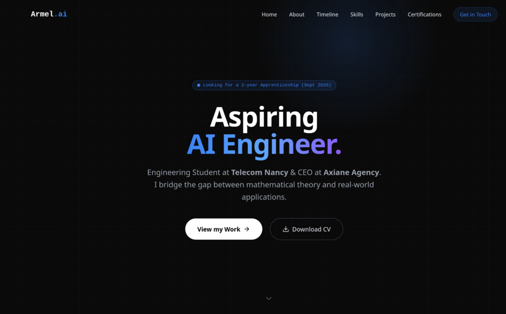

# ⚡ Armel KI — AI & Data Portfolio



Modern, dark-themed portfolio for an **AI & Data Engineering student**.
Designed to showcase Data Science projects, certifications, and academic milestones with a clean, high-performance UI.

🔗 **Live Demo:** [armel-ki-portfolio.vercel.app](https://armel-ki-portfolio.vercel.app)

---

## 🚀 Features

- **🌍 Bilingual (FR / EN):** Full i18n with language detection and persistence.
- **🎨 Modern UI/UX:** Dark aesthetic with glassmorphism and an interactive spotlight background.
- **🍱 Bento Grid:** Asymmetric grid to showcase technical skills.
- **🗺️ Interactive Timeline:** Visual journey through education, experience, and awards.
- **📂 Project Filtering:** Filter projects by category (Data & AI, Web, Tools).
- **📜 Certification Hub:** Browse credentials, highlight featured ones, and download PDF certificates.
- **📱 Fully Responsive:** Optimized for mobile, tablet, and desktop.

---

## 🛠️ Tech Stack

- **Core:** [React 19](https://react.dev/) + [Vite](https://vitejs.dev/)
- **Styling:** [Tailwind CSS v3](https://tailwindcss.com/)
- **Animations:** [Framer Motion](https://www.framer.com/motion/)
- **Icons:** [Lucide React](https://lucide.dev/)
- **Deployment:** [Vercel](https://vercel.com/)

---

## 📂 Project Structure

The project follows a **data-driven** architecture: content is separated from logic.

```bash
Mon_Portfolio/
├── public/
│   └── assets/             # Static files (images, PDFs)
│       ├── documents/      # Certificates & CV
│       └── images/         # Project screenshots & profile pic
├── src/
│   ├── components/
│   │   ├── layout/         # Navbar, Footer
│   │   ├── sections/       # Hero, About, Skills, Projects, etc.
│   │   └── ui/             # Reusable UI (SectionTitle, etc.)
│   ├── context/            # LanguageContext (i18n provider)
│   ├── data/               # Structured content (projects, experiences, certifications)
│   └── App.jsx
└── tailwind.config.js
```

---

## 🏁 Getting Started

```bash
git clone https://github.com/ArmelKI/Mon_Portfolio.git
cd Mon_Portfolio
npm install
npm run dev
```

Open `http://localhost:5173` in your browser.

---

## 📝 Customization

Most content lives in `src/data/` and `src/data/i18n.js` (translatable strings):

- **Projects:** add an entry to `src/data/projects.js` (and its FR/EN copy in `i18n.js`).
- **Experience / timeline:** `src/data/experiences.js` + `i18n.js`.
- **Certifications:** `src/data/certifications.js` (set `featured: true` to highlight one).
- **Personal info & socials:** `src/data/profile.js`.

### Adding images or PDFs

1. Place the file in `public/assets/...`
2. Reference it in your data files as a path string: `"/assets/images/my-file.png"`

---

## 🚢 Deployment

Optimized for **Vercel**: push to GitHub, import the repo, and deploy.

---

## 👤 Author

**Armel Stéphane Novak KI** — Engineering Student @ Télécom Nancy

- 💼 [LinkedIn](https://www.linkedin.com/in/armel-stephane-novak-ki)
- 🐙 [GitHub](https://github.com/ArmelKI)
- 📧 [Email](mailto:kiarmelstephanenovak@gmail.com)

---

*Made in Nancy, France.*
